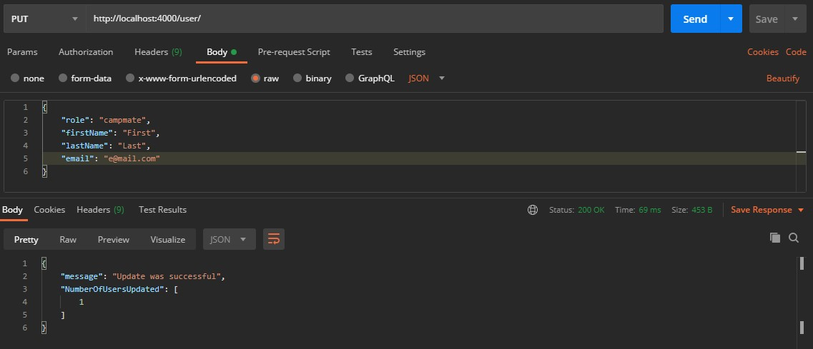

# **Camp Awesomesauce**

### Welcome to the Camp Awesomesauce App Server. 
You can use this app to make and manage packlists for your next burn. You can create an account, add some profile information, and find resources to ensure next year was better. 

You can find the deployed project [here](https://campawesomesauce.herokuapp.com/).
It pairs with the client side, found [here](https://github.com/adventurernav/CampAwesomesauce).

###  In honor of the Principles Radical Inclusion, Radical Self-Expression, Communal Effort, and Participation, your contributions are always welcome.

### Features

- Users can register for an account, then view or update their information later. They can choose to delete their account. 
- Users can create a profile, then view or update their information later. They can choose to delete their profile. 
- Users can create any number of packlists. They can update or delete them later. 
- Users can add items to each packlist and update or delete them.
- Admins can manage the users' accounts, updating name, email, passwords or deleting users entirely.

### Technologies
#### This server is built with: 
- JavaScript
- PostgreSQL
- Node
- Express
- Sequelize
- JWT
- Bcrypt

### Cloning this project
Navigate to where you want the project cloned to in the command line. The client and server are seperate, so I suggest making a new folder. Let's make a few commands:

`git clone https://github.com/adventurernav/serverCampAwesomesauce`

`npm i`

`npm run dev`

Be sure to check out the `readme.md` on the client app if you want to clone that as well. 

Now that we have the server running, we can either install the client or use postman to access the server. For this demo I will be using postman. 

## Database Tables:

There are 4 Tables in this database.

## Users
| Type of Information | (name in Model) | data type |
|---------------------|-----------------|-----------|
| ID | (id) | integer |
| E-mail address | (email) | string |
| Password | (password) | string |
| Role | (role) | string |
| First Name | (firstName) | string |
| Last Name | (lastName) | string |
| Signup Date | (createdAt) | string |
| Last Change | (updatedAt) | string |
---

## Profiles
| Type of Information | (name in Model) | data type |
|---------------------|-----------------|-----------|
| ID | (id) | integer |
| Profile Owner ID | (userId) | integer |
| Playaname, similar to screen name | (playaname) | string |
| Years at Burning Man | (burnsAttended) | integer |
| Avatar | (profilePic) | string |
| Favorite Principle | (favPrinciple) | string |
| About Me | (aboutMe) | string |
| Status | (status) | string |
| Creation Date | (createdAt) | string |
| Last Change | (updatedAt) | string |
---

## Packlists
| Type of Information | (name in Model) | data type |
|---------------------|-----------------|-----------|
| ID | (id) | integer |
| Profile Owner ID | (userId) | integer |
| Name of Packlist | (title) | string |
| Creation Date | (createdAt) | string |
| Last Change | (updatedAt) | string |

## Items
| Type of Information | (name in Model) | data type |
|---------------------|-----------------|-----------|
| ID | (id) | integer |
| Parent Packlist ID | (packlistId) | integer |
| Name of Item | (itemName) | string |
| Quantity | (qty) | integer |
| If the user already owns an item | (isOwned) | string |
| If the user has already packed an item | (isPacked) | string |
| Creation Date | (createdAt) | string |
| Last Change | (updatedAt) | string |

### Middleware: 
Validate Session: Checks the token and returns the user object. 
Validate Admin: Checks the token and returns the value of the 'role'.

### Endpoints: 
#### User
##### /user/register
POST: Adds a new user

##### /user/login
POST: Checks the email and password against the database and returns an object with a new JSON Web Token and User information.

##### /user/
Requires Validate Session Middleware

GET: Returns a user object for the authenticated user. 

DELETE: Removes a user's account entirely. Returns a success message. 

PUT: Updates a user's name or email. Returns an object containing the array 'NumberOfUsersUpdated', which should be exactly [1].

##### /user/password
Requires Validate Session Middleware

PUT: Updates a user's password. Encrypts the password using bcrypt. Returns an object containing the array 'NumberOfUsersUpdated', which should be exactly [1].

#### Profile
Requires Validate Session Middleware
##### /profile/register/

POST: Creates a new profile page for a specific user. Checks the user's id in the validate session user object. Returns an object with the profile information.

##### /profile/

PUT: Updates a user's profile information. Returns an object containing the array 'NumberOfProfilesUpdated', which should be exactly [1].

GET: Returns a user object for the authenticated user.

DELETE: Destroys the authenticated user's profile. Checks for the id in the validate session user object.

##### /profile/:id

GET: Returns and object with each user's profile information.

#### Packlist
Requires Validate Session Middleware

##### /packlist/
GET: Returns an object for each of the authenticated user's packlists.

POST: Creates a new packlist based on user input. 

##### /packlist/:id
PUT: Updates the title of a packlist. The id is supplied in the params and the userid is pulled from validate session.
Returns an object containing the array 'NumberOfPacklistsUpdated', which should be exactly [1]. 

DELETE: Removes a packlist. The id is supplied in the params and the userid is pulled from validate session. Returns a success message.

#### Item
Requires Validate Session Middleware

##### /item/:packlistId
GET: Returns an object for each item in this packlist. 

POST: Adds a new item to this packlist. Returns the new item object.

##### /item/:itemId
PUT: Updates an item's details. Returns an object containing the array 'NumberOfItemsUpdated', which should be exactly [1].

DELETE: Removes an item from a packlist. Returns a success message. 

#### Token

##### /tokenChecker/
Requires Validate Session Middleware

GET: Checks to see if the token is valid and returns a success message.

#### Admin
Requires Validate Admin Middleware

##### /admin/users
GET: Returns an object containing all registered users. 

##### /admin/:userId
PUT: Updates a user's details. Returns an object containing the array 'NumberOfUsersUpdated', which should be exactly [1].

##### /admin/password/:userId
PUT: Updates a user's password. Returns an object containing the array 'NumberOfUsersUpdated', which should be exactly [1].

##### /admin/users/id
DELETE: Removes a user's account. Returns a success message and a new array of user objects for the remaining users in the database. 

